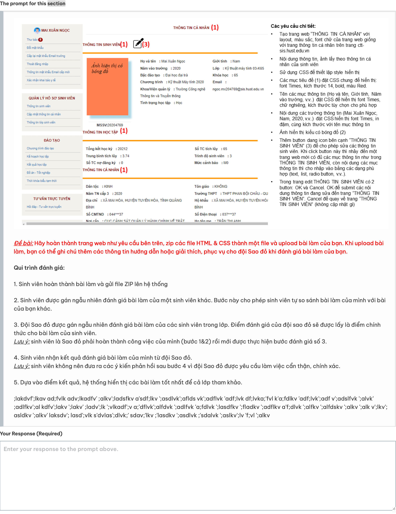

# ORA #1 - HTML, CSS
1.  **Tạo trang web “THÔNG TIN CÁ NHÂN”**: Trang web này cần có layout, màu sắc, font chữ giống với trang thông tin cá nhân trên trang ctt-sis.hust.edu.vn. Nội dung thông tin và ảnh lấy theo thông tin cá nhân của sinh viên.

2. **Sử dụng CSS để thiết lập style hiển thị**:
    - Các mục tiêu đề cần đặt CSS chung để hiển thị: font Times, kích thước 14, bold, màu Red.
    - Tên các mục thông tin (Họ và tên, Giới tính, Năm vào trường, v.v.) cần đặt CSS để hiển thị font Times, chữ nghiêng, kích thước tùy chọn cho phù hợp.
    - Nội dung các trường thông tin (Mai Xuân Ngọc, Nam, 2020, v.v.) cần đặt CSS hiển thị font Times, in đậm, cùng kích thước với tên mục thông tin.

3. **Ảnh hiển thị kiểu có bóng đổ**: Cần thiết lập style cho ảnh để hiển thị kiểu có bóng đổ.

4. **Thêm button dạng icon bên cạnh “THÔNG TIN SINH VIÊN”**: Button này sẽ cho phép sửa các thông tin sinh viên. Khi click button này sẽ nhảy đến một trang web mới có đủ các mục thông tin như trong THÔNG TIN SINH VIÊN, còn nội dung các mục thông tin thì cho nhập vào bằng các dạng phù hợp (text, list, radio button, v.v…).

5. **Trong trang chỉnh sửa THÔNG TIN SINH VIÊN có 2 button: OK và Cancel**:
    - Button OK để submit các nội dung thông tin đang sửa đến trang “THÔNG TIN SINH VIÊN”.
    - Button Cancel để quay về trang “THÔNG TIN SINH VIÊN” (không cập nhật gì).

