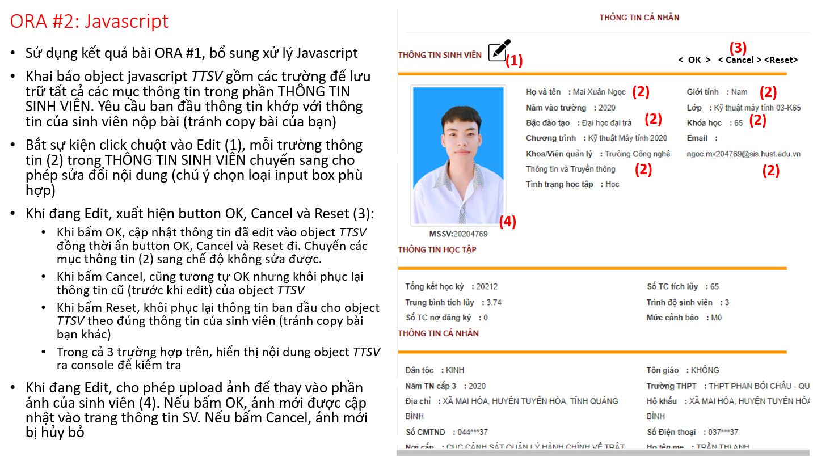

# ORA #2: JAVASCRIPT

Các tiêu chí chấm điểm:

- Thông tin hiển thị ban đầu không đúng với thông tin của người làm bài, tức là copy bài của bạn khác: 2 điểm
- Khai báo object TTSV đúng, đủ các trường thông tin. Các trường thông tin được khởi tạo giá trị ban đầu và hiển thị trong trang THÔNG TIN SINH VIÊN khớp với thông tin của tác giả: 3 điểm
- Click Edit, chuyển các mục thông tin sang dạng có thể sửa: 4 điểm
- Sử dụng các input box dạng phù hợp với các mục thông tin (list, radio, check, v.v..): 5 điểm
- Xử lý button Cancel, khôi phục lại các trường thông như trước khi edit và in ra console: 6 điểm
- Xử lý button Reset, reset lại các trường thông tin về trạng thái ban đầu và in ra console: 7 điểm
- Xử lý button OK, cập nhật các trường thông tin vào object TTSV và in ra console: 8 điểm
- In nội dung object TTSV ra log đúng trong 3 trường hợp: OK, Cancel, Reset: 9 điểm
- Xử lý upload file ảnh và cập nhật vào trang TTSV: 10 điểm

